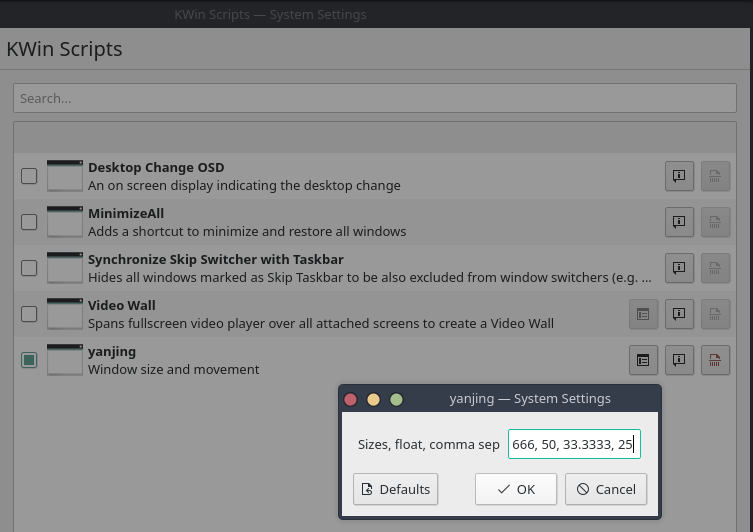

# Yanjing

KWin script to resize and move windows. Like Spectacle/Rectangle on mac.

## Installation

Available in the [KDE store](https://store.kde.org/p/1492899/)

## Configuration

### Via command-line/settings file

You can customize the sizes this script cycles through by setting them in your
kwin config using this command:

```sh
kwriteconfig5 --file kwinrc --group Script-yanjing --key sizes "50,66,34,100"
qdbus org.kde.KWin /KWin reconfigure
```

This will write the sizes to your `~/.config/kwinrc` file under the
`[Script-yanjing]` group.
You may need to disable and re-enable the plugin in
`System Settings > KWin Scripts` for the sizes to be read.

### Via gui

The sizes can be changed by using the settings button in `System Settings
> KWin Scripts`



To enable this menu you may need to link the script metadata to kservices5:

```sh
mkdir -p ~/.local/share/kservices5/
ln -s ~/.local/share/kwin/scripts/yanjing/metadata.desktop ~/.local/share/kservices5/yanjing.desktop
```

Why? See this [issue](https://github.com/faho/kwin-tiling/issues/79#issuecomment-311465357)

Restarting plasma afterwards in recommended.

## Commands 

- Yanjing LEFT - `no default`
    - Vertically maximize, flush the window to the LEFT side of the screen, or
      resize width if already flushed.
- Yanjing CENTER - `no default`
    - Vertically maximize, center window horizontally, or resize width if
      already centered. Centering allows a 2px margin of error.
- Yanjing RIGHT - `no default`
    - Vertically maximize, flush the window to the RIGHT side of the screen,
      or resize width if already flushed.
- Yanjing yMax + LEFT - `ctrl-shift-meta-a`
    - Vertically maximize, flush the window to the LEFT side of the screen, or
      resize width if already flushed.
- Yanjing yMax + CENTER - `ctrl-shift-meta-x` - 
    - Vertically maximize, center window horizontally, or resize width if
      already centered. Centering allows a 2px margin of error.
- Yanjing yMax + RIGHT - `ctrl-shift-meta-d`
    - Vertically maximize, flush the window to the RIGHT side of the screen,
      or resize width if already flushed.

### Resizing logic

The window will steps through the [Sizes array](./contents/code/main.js).
It does so in reverse order, so as you "shove" the window against each edge of
the screen or into the center more, it shrinks. It will loop back to the
largest size.

## License

MIT
